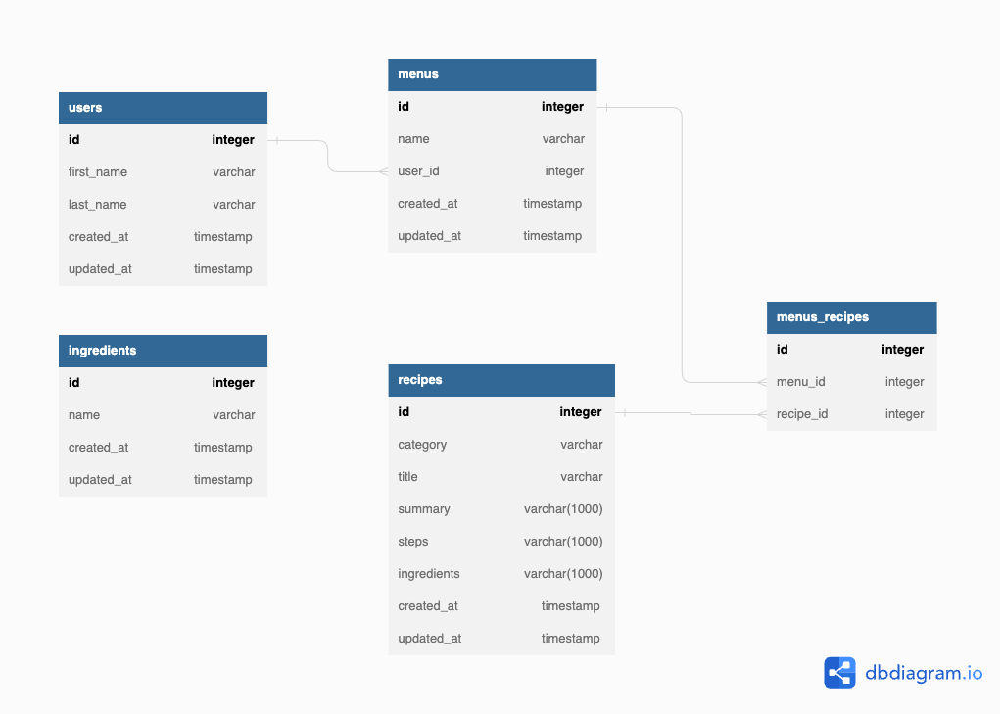

# CHINESE MENU GENERATOR-BACKEND

#### Team Building API Exercise Using NodeJS/ExpressJS

## Table of Contents

- [Summary](#summary)
- [Authors](#authors)
- [Goals](#goals)
  - [Project First Itearation Goals](#project-first-iteration-goals)
  - [Extension Goals for Future Iterations](#extension-goals-for-future-iterations)
- [Stack](#stack)
- [Install Locally](#install-locally)
- [Schema](#schema)
- [Swagger](#swagger)
- [Endpoints](#endpoints)
  - [Postman](#postman)
  - [User Endpoints](#user-endpoints)
  - [Menu Endpoints](#menu-endpoints)
  - [Recipe Endpoints](#recipe-endpoints)

## Summary

The main goal of this exercise was to build an API in NodeJS and ExpressJS that uses TypeScript including tests - Jest - and documentation - swagger.

The secondary goal of our project was to enhance our ability to work together effectively, enabling us to successfully complete larger projects in the future. To accomplish this, we leveraged our collective work and life experiences, allowing us to incorporate valuable insights from each team member. As a result, we established productive patterns that fostered seamless communication and clarity in standards.

The main technical challenge was to incorporate TypeScript since we are both relatively new to building APIs with NodeJS and TypeOrm.

## Authors

#### Lingling Gan

Github: [github.com/MandyGan](https://github.com/MandyGan)

LinkedIn: [linkedin.com/in/lingling-gan/](https://www.linkedin.com/in/lingling-gan/)

#### Nico Rithner

Github: [github.com/nicorithner](https://github.com/nicorithner) 

LinkedIn: [linkedin.com/in/nicorithner/](https://www.linkedin.com/in/nicorithner/)

## Goals

### Project First Iteration Goals

- A CRUD a API with Users, Menus, and Recipes
- Recipes are generated by an external API - [spoonacular api](https://spoonacular.com/food-api) but transformed into a new recipe format before sending a JSON response through our API.
- APIs include tests
- APIs are documented using swagger

### Extension Goals for Future Iterations

- A User can create a menu indicating preferred ingredients
- An user can create a menu based on a selection of preferred ingredients
- An user can update a menu's recipes individually without generating all recipes
- Implement User authentication

## Stack

- NodejS
- ExpressJS
- TypeScript
- TypeOrm
- PosgreSQL

## Install Locally

To run locally please first make sure to already have installed [Node](https://nodejs.org/en) and [NPM](https://docs.npmjs.com/downloading-and-installing-node-js-and-npm)

- Clone this repo locally `git clone git@github.com:nicorithner/chinese-menu-generator-be.git`

To run the api:

- Run `npm install`
- Run `npm run build`
- Run `npm run dev`

It will run at `http://localhost:8000/`

To test:

- Run `npm run test`

If this fails run tests individually:

- Run `npm run test __tests__/routes/users.test.ts`
- Run `npm run test __tests__/routes/menus.test.ts`
- Run `npm run test __tests__/routes/recipes.test.ts`

## Schema

### User

  - Id
  - firstName
  - lastName

A user has many menus

### Menu

  - Id
  - name
  - user_id
  
A menu belongs to a user

### Recipe

  - Id
  - category
  - title
  - summary
  - steps
  - ingredients

A recipe belongs to a menu

## Swagger

To access API documentation please navigate to

`http://localhost:8000/api-docs`

## Endpoints

### Postman

Visit postman to checkout the collection of enpoints and try it locally.

### User Endpoints

##### GET "/users"

    Finds all users

##### GET "/users:id"

    Finds an individual user by id

##### POST "/users"

    Creates a new user

##### PUT "/users/:id"

    Updates an individual user by id

##### DELETE "/users/:id"

    Deletes an individual user by id

##### GET "/users/:id/menus"

    Lists a user by id menus

### Menu Enpoints

##### GET "/menus"

    Finds all menus

##### GET "/menus:id"

    Finds an individual menu by id

##### POST "/menus"

    Creates a new menu

##### PUT "/menus/:id"

    Updates an individual menu by id

##### DELETE "/menus/:id"

    Deletes an individual menu by id

##### GET "/menus/:id/recipes"

    Lists a menu recipes

### Recipe Endpoints

##### GET "/recipes"

    Finds all recipes

##### GET "/recipes:id"

    Finds an individual recipe by id

##### POST "/recipes"

    Creates a new recipe

##### PUT "/recipes/:id"

    Updates an individual recipe by id

##### DELETE "/recipes/:id"

    Deletes an individual recipe by id
